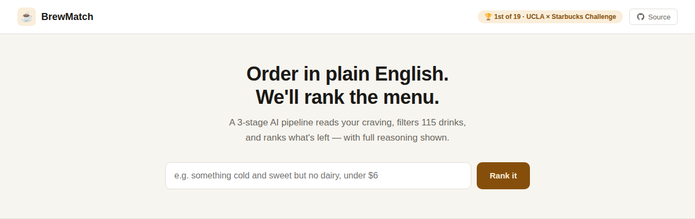

# Starbucks Order Whisperer

**1st place of 19 teams at the UCLA × Starbucks Data Challenge, with 88.3% NDCG.**
Turns free-text drink orders into a ranked list of menu items. Claude reads the request, deterministic rules filter the menu, and a constraint-aware scorer ranks what is left.

[**Live demo**](TODO_DEMO_URL) · [Web app code](web/)



## The problem

Customers don't order in SQL. They say things like:

> *"yo i need a latte that's max 250 calories and 25g sugar or less"*

The task: given 115 drinks and queries like this, return the matching drinks in the right order. Scored by **NDCG**, so order matters, not just the set.

The business question behind it: can a menu understand how people actually talk, and still respect hard limits like calories, price and allergies?

## How it works

```
query: "iced oat-milk latte, keep it under 250 cal"
            │
            ▼
┌──────────────────────────┐
│ 1. EXTRACT   Claude      │  text → structured constraints (JSON schema)
└──────────────────────────┘
            │  { category: espresso, temperature: iced,
            │    dairy_free: true, max_calories: 250 }
            ▼
┌──────────────────────────┐
│ 2. FILTER    pandas      │  hard rules, fully deterministic
└──────────────────────────┘
            │  8 drinks survive
            ▼
┌──────────────────────────┐
│ 3. RANK      hybrid      │  constraint margin + semantic tiebreak
└──────────────────────────┘
            │
            ▼
      ranked drink list
```

**1. Extract** (`stage1_extract.py`). Claude Haiku 4.5 maps the query to typed fields. Output is pinned to a JSON schema, so it can't return malformed JSON.

**2. Filter** (`stage2_filter.py`). Plain pandas. Category, temperature, calories, sugar, price, dairy, vegan, milk and caffeine become hard filters.

**3. Rank** (`stage3_rank.py`). A hybrid score:

```
score = constraint_margin + 0.001 × semantic_similarity
```

## Key decisions

The model is the easy part. These choices are what moved the score.

- **Use the LLM only where language is hard.** Claude does extraction. Everything after it is deterministic, so results are reproducible and easy to debug.
- **Rank by constraint margin, not similarity.** Under a 250-cal cap, a 0-cal drink should beat a 200-cal one. The training labels confirmed this, so margin is the primary signal.
- **Keep similarity as a tiebreaker only.** Its weight (0.001) is too small to ever override a real constraint gap.
- **Learn caffeine levels from the data.** "Medium" and "high" map to mg ranges reverse-engineered from the labels, including a real 150 to 200 mg overlap.
- **Model what people mean.** "It's hot out" does not mean iced. "Iced coffee" spans brewed, cold brew and espresso. "Black coffee" excludes plant milks too, which `dairy_free` alone can't express.
- **Never return nothing.** If filters remove every drink, the pipeline relaxes price, then sugar, then calories, until something fits.

## What the rebuild changed

After the competition, I rebuilt the team solution on my own. The goal was cleaner engineering, not a new leaderboard score:

- **Structured output** replaced prompt-and-parse. A whole class of parsing failures is gone.
- **Margin-first ranking** replaced similarity-first ranking with hand-tuned bonuses.
- **Local embeddings** (`all-MiniLM-L6-v2`) replaced a paid API that hit rate limits mid-run.
- **One notebook became four modules**, each with its own sanity checks.
- **A web app** ([`web/`](web/)) shows each stage live. It uses TF-IDF for the tiebreak to fit free-tier hosting, and runs on a similar public 115-drink menu (TODO_SOURCE_LINK), not the challenge data.

## Run it

The challenge dataset is confidential and not included. Bring your own files using the schema below.

```bash
pip install -r requirements.txt
export ANTHROPIC_API_KEY="sk-ant-..."
python pipeline.py queries_test.csv      # writes submission.csv
```

Each stage also runs on its own with built-in checks:

```bash
python stage1_extract.py   # field-level extraction accuracy
python stage2_filter.py    # filter correctness
python stage3_rank.py      # ranking on worked examples
```

**Data format**

- `products.csv`: `product_id, name, category, subcategory, temperature, caffeine_mg, calories, sugar_g, protein_g, contains_dairy, contains_nuts, contains_gluten, is_vegan, description, price`
- `queries_*.csv`: `query_id, query_text` (training set adds labels)

## Repo layout

| Path | Purpose |
|---|---|
| `pipeline.py` | Runs all three stages plus fallback |
| `stage1_extract.py` | Claude extraction with JSON schema |
| `stage2_filter.py` | Deterministic filtering |
| `stage3_rank.py` | Margin-first hybrid ranking |
| `web/` | FastAPI backend and demo frontend |

## Credits

Competition solution built with TODO_TEAMMATES. This repo is my solo rebuild and contains only my own code.

*Built for the UCLA × Starbucks Data Challenge. The dataset belongs to the challenge organizers.*
